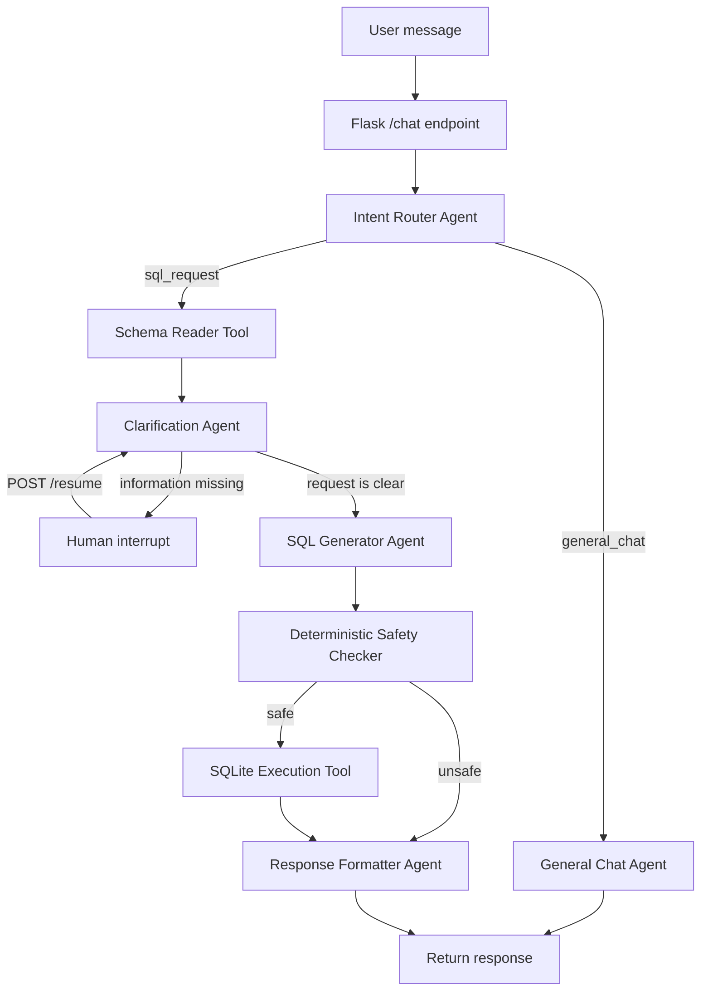

# AgentQL

AgentQL is a full-stack, multi-agent SQLite assistant. Users describe database tasks in plain English—such as creating a table, inserting records, or querying data—and a LangGraph workflow routes the request through specialized agents, validates the generated SQL, executes it against a conversation-specific SQLite database, and returns a concise response.

The React interface also provides a dataset view for browsing the tables and rows created during the current conversation.

## Why this project exists

Working directly with SQL requires knowing the database schema, choosing the correct SQLite syntax, and avoiding unsafe operations. AgentQL separates those responsibilities into focused stages so that each part of the workflow has one clear job:

- understand what the user wants;
- inspect the current database before generating SQL;
- ask for missing details instead of guessing;
- generate SQLite-specific statements;
- reject operations outside the project's safety policy;
- execute approved statements in an isolated database; and
- translate raw results into a readable answer.

This design makes the system easier to understand, test, and extend than a single prompt that performs every task at once.

## Features

- Natural-language SQLite operations: `CREATE`, `SELECT`, `INSERT`, `UPDATE`, `DELETE`, and `ALTER`
- Intent-based routing between normal chat and database work
- Schema-aware SQL generation
- Human-in-the-loop clarification for incomplete requests
- A deterministic SQL safety gate before execution
- Separate SQLite database files for separate chat threads
- Persistent, paginated chat history
- Dataset browser for inspecting tables, columns, and rows
- React/Vite frontend and Flask JSON API
- LangGraph checkpoints for interrupting and resuming an agent run

## Agent structure and execution chain

The orchestration graph is defined in `backend/main.py`. Although the project is described as multi-agent, the agents are specialized LLM-backed nodes coordinated inside one LangGraph state machine rather than independent background processes.



### 1. Intent Router Agent

The entry point classifies each message as either:

- `general_chat` for greetings, help, capability questions, or unrelated conversation; or
- `sql_request` for database and dataset operations.

This keeps conversational requests away from the SQL execution path.

### 2. General Chat Agent

General messages are answered by a concise SQL-focused assistant. This branch ends without reading or modifying the database.

### 3. Schema Reader Tool

For a SQL request, the workflow opens the SQLite database associated with the current `thread_id`, reads table metadata from `sqlite_master`, and obtains column details with `PRAGMA table_info`. The resulting schema is passed to downstream agents so they can reason about the database that actually exists.

### 4. Clarification Agent

The clarification agent checks whether the schema and conversation contain enough information to produce valid SQL. For example, an update needs values and a `WHERE` condition, while a table creation request needs a table name and columns.

If information is missing, LangGraph raises an interrupt. The API returns the agent's question to the frontend, and the next answer is sent to `/resume` using the same thread ID. The workflow then continues from its checkpoint instead of starting over.

### 5. SQL Generator Agent

Once the request is sufficiently clear, this agent produces SQLite-compatible SQL only. Its prompt enforces rules such as schema-aware table and column use, `WHERE` clauses for updates and deletes, and avoidance of MySQL/PostgreSQL-only syntax.

### 6. Safety Checker

The safety checker is regular Python code rather than another LLM. It splits generated SQL into statements and permits only statements beginning with:

- `SELECT`
- `INSERT`
- `UPDATE`
- `DELETE`
- `CREATE`
- `ALTER`

It rejects empty or unrecognized statements, `DROP TABLE`, `DROP DATABASE`, `TRUNCATE`, `PRAGMA`, `ATTACH`, `DETACH`, and any `DELETE` statement without a `WHERE` clause.

> This is a project-level guardrail, not a complete SQL sandbox. Do not expose the current development server or database execution layer to untrusted public traffic without stronger parsing, authorization, resource limits, and isolation.

### 7. SQL Execution Tool

Approved SQL is executed with Python's built-in `sqlite3` module. Each conversation uses a database named `agent_<thread_id>.db`, which isolates its tables and data from other conversations. Multiple explicitly requested statements can be executed in sequence, and the transaction is committed after successful execution.

### 8. Response Formatter Agent

The final agent turns raw rows or execution status into a short, user-friendly response. Common SQLite errors—such as a missing table, missing column, duplicate value, or syntax error—are converted to plain language before the response is returned.

## Shared graph state

The nodes communicate through the `GraphState` type in `backend/agent_class.py`:

| Field | Purpose |
| --- | --- |
| `messages` | Accumulated LangChain conversation messages |
| `intent` | Router result: general chat or SQL request |
| `schema` | Current thread database schema |
| `clarified` | Whether the request contains enough information |
| `sql` | SQL produced by the generator |
| `is_safe` | Result of the deterministic safety check |
| `execution_result` | Raw success message, rows, or database error |

LangGraph's in-memory checkpointer stores the active graph state by `thread_id`. Separately, `agent_chat.db` persists displayable chat history. Because graph checkpoints are currently in memory, interrupted runs do not survive a backend restart even though chat history does.

## Application architecture

```text
Browser (React + Vite)
        |
        | HTTP/JSON
        v
Flask API
        |
        +-- LangGraph agent workflow
        |      +-- Groq-hosted openai/gpt-oss-20b models
        |      +-- schema and SQL tools
        |      +-- in-memory checkpoints
        |
        +-- agent_chat.db            (chat history)
        +-- agent_<thread_id>.db     (thread dataset)
```

## Project structure

```text
multi-agent-sql/
├── backend/
│   ├── api.py                    # Flask routes and graph invocation
│   ├── main.py                   # LangGraph nodes, routing, and compilation
│   ├── agent_class.py            # Graph state and structured model outputs
│   ├── chat_history.py           # Persistent message history
│   ├── chat_tables.py            # Dataset/table inspection helpers
│   ├── wsgi.py                   # WSGI application entry point
│   ├── enums/
│   │   └── llm_status.py         # Response status and role enums
│   ├── models/
│   │   ├── intent_router.py      # Intent classification chain
│   │   ├── general_chat.py       # Conversational response chain
│   │   ├── clarrifier.py         # Clarification chain (filename as implemented)
│   │   ├── sql_generator.py      # SQLite generation chain
│   │   └── response_formatter.py # Result presentation chain
│   ├── tools/
│   │   ├── schema_tool.py        # Reads the active database schema
│   │   ├── execute_sql.py        # Safety helpers and SQL execution
│   │   └── human_interrupt.py    # Reusable LangGraph interrupt tool
│   └── requirements.txt
├── frontend/
│   ├── src/
│   │   ├── App.jsx               # Chat/dataset page state
│   │   ├── api.js                # Backend API client
│   │   └── components/           # Chat, navigation, and dataset UI
│   ├── package.json
│   └── vite.config.js
├── .gitignore
└── README.md
```

## Prerequisites

- Python 3.10 or newer
- Node.js 20.19+ or 22.12+ (required by Vite 8)
- npm
- Groq API keys with access to `openai/gpt-oss-20b`

## Local setup

### 1. Clone the repository

```bash
git clone https://github.com/varun3009/AgentQL.git
cd AgentQL
```

### 2. Configure and start the backend

From the project root:

```bash
cd backend
python -m venv .venv
```

Activate the environment:

```bash
# Windows PowerShell
.venv\Scripts\Activate.ps1

# macOS/Linux
source .venv/bin/activate
```

Install dependencies:

```bash
python -m pip install -r requirements.txt
```

Create `backend/.env`:

```dotenv
CMD_API_KEY=your_groq_api_key
RESPONSE_API_KEY=your_groq_api_key
GEN_API_KEY=your_groq_api_key
CLAR_API_KEY=your_groq_api_key
```

The same Groq key can be used for every variable. The repository's current `.env` also defines `INTENT_API_KEY`, but the intent router implementation currently reads `RESPONSE_API_KEY`.

Start Flask:

```bash
python api.py
```

The development API runs at `http://localhost:6969`.

### 3. Configure and start the frontend

In another terminal, from the project root:

```bash
cd frontend
npm install
```

Create `frontend/.env`:

```dotenv
VITE_API_URL=http://localhost:6969
```

Start Vite:

```bash
npm run dev
```

Open the local URL printed by Vite, typically `http://localhost:5173`.

## How to use AgentQL

Enter a request in the Chat view, for example:

```text
Create a students table with an integer id, name, unique email, and grade.
```

Then continue naturally:

```text
Add Maya with maya@example.com in grade 10.
Show all students.
Update Maya's grade to 11 where her email is maya@example.com.
```

If a request is ambiguous, the assistant asks one follow-up question. Answer it in the same chat to resume the paused workflow. Use the Dataset tab to inspect the resulting tables and rows.

The browser stores the active `thread_id` in `localStorage`, so refreshing the page restores that conversation and its associated database.

## API reference

### Send a message

`POST /chat`

```json
{
  "message": "Show all students",
  "thread_id": "optional-existing-thread-id"
}
```

If no thread ID is supplied, the backend creates one. A completed response has status `2`; a clarification interrupt has status `1`.

```json
{
  "role": 2,
  "status": 2,
  "response": "I found 2 students...",
  "thread_id": "generated-or-existing-thread-id"
}
```

### Resume an interrupted request

`POST /resume`

```json
{
  "thread_id": "existing-thread-id",
  "answer": "Use the students table"
}
```

### Read chat history

`GET /history/<thread_id>?page=1&page_size=15`

### List tables

`GET /tables/<thread_id>`

### Read a table's schema and rows

`GET /tables/<thread_id>/<table_name>`

## Development commands

Frontend commands:

```bash
npm run dev      # Start the Vite development server
npm run build    # Create a production build
npm run lint     # Run ESLint
npm run preview  # Preview the production build
```

To regenerate the LangGraph diagram, run the graph module from the backend directory:

```bash
cd backend
python main.py
```

This writes `backend/graph.png` and may require network access for Mermaid rendering.

## Current limitations

- Checkpoints use `InMemorySaver`, so paused workflows are lost when Flask restarts.
- SQLite database files are created relative to the backend process's working directory.
- Chat history and per-thread databases have no cleanup or retention policy.
- CORS is enabled globally for development.
- The table-data endpoint interpolates the table name into SQL and should be hardened before accepting untrusted identifiers.
- The SQL safety check is string-based and should be replaced or supplemented with a proper SQL parser for production use.
- There is currently no authentication, authorization, automated test suite, or production deployment configuration.

## Extending the agent chain

To add a specialized agent:

1. Define its prompt and model chain under `backend/models/`.
2. Add any state it needs to `GraphState` in `backend/agent_class.py`.
3. Implement a node function in `backend/main.py`.
4. Register the node with `graph_builder.add_node(...)`.
5. Connect it with a direct or conditional edge.
6. Add deterministic validation around any action that changes data or external state.
7. Test both the successful route and failure, clarification, and unsafe-input routes.

Keep each agent narrowly focused. Deterministic work—validation, permissions, parsing, and execution—should remain in normal code wherever possible, while LLM agents handle language understanding and response generation.

## License

No license file is currently included. Add a license before redistributing or accepting external contributions.
